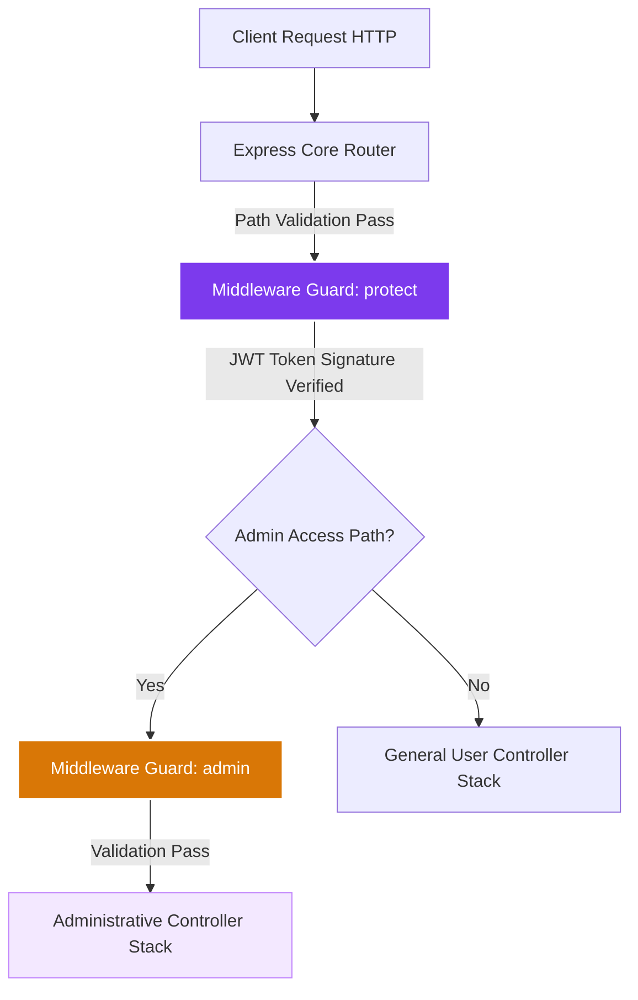
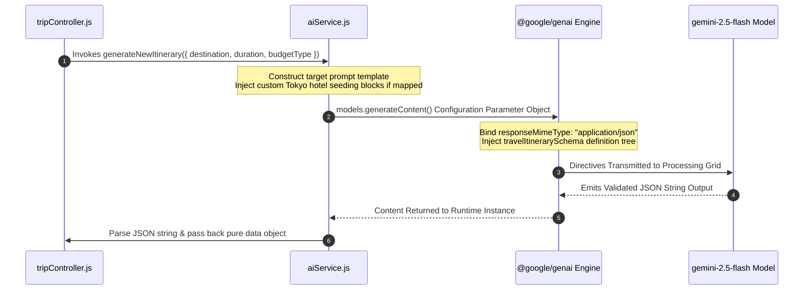
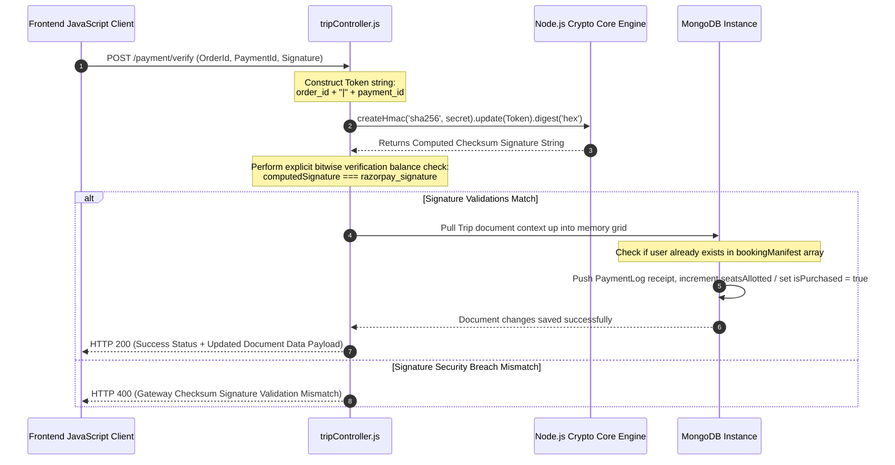

# 🌌 MoonVoyage Operations — Scalable Full-Stack AI Itinerary & E-Commerce Ecosystem

Welcome to the production-ready master architectural blueprint for the **MoonVoyage Operations Platform**. This enterprise ecosystem combines an intelligent client dashboard, deterministic generative AI orchestration engines, role-based administrative workspaces, and a cryptographic e-commerce payment infrastructure built entirely on the modern MERN stack.

---

## 🏛️ System & Architecture Topology

The application relies on a micro-monolith layout pattern. Request filtering pipelines protect database boundaries by enforcing strict JSON verification rules, cross-origin security walls, and role-based validation hooks before client hits register on Express route controllers.

### 1. Modular Request Orchestration Trace
The diagram below shows how an incoming client interaction safely filters through the twin-guard authentication security firewalls:


```mermaid
    USER ||--o{ TRIP : "owns / generates"
    USER {
        ObjectId _id PK
        String name
        String email
        String password
        String role "user | admin"
        Boolean isAccountActive
    }
    TRIP ||--o{ ACTIVITY : "contains structural daily tracking arrays"
    TRIP {
        ObjectId _id PK
        ObjectId userId FK "Creator / Admin Link"
        ObjectId assignedTo FK "Target User Allocation"
        Boolean isPublic
        Boolean isPurchased
        String destination
        Number price
        Number totalSeats
        Number seatsAllotted
        Object budgetBreakdown "Embedded Array Logs"
        Array hotels "Embedded Hotel Objects"
    }
    TRIP ||--o{ BOOKING_MANIFEST : "embeds verification records directly"
    BOOKING_MANIFEST {
        ObjectId userId FK "Buyer Reference"
        String razorpayOrderId
        String razorpayPaymentId
        Number amountPaid
        Date purchasedAt
    }
```


```mermaid
    graph LR
    A[Admin Deletes User ID] --> B[User.findByIdAndDelete]
    B --> C[Trip.deleteMany: userId == Target User ID]
    B --> D[Payment.deleteMany: userId == Target User ID]
    C --> E[Platform Storage Synced cleanly with zero data fragmentation]
    D --> E
    
    style A fill:#d97706,stroke:#fff,stroke-width:1px,color:#fff
    style E fill:#059669,stroke:#fff,stroke-width:1px,color:#fff
